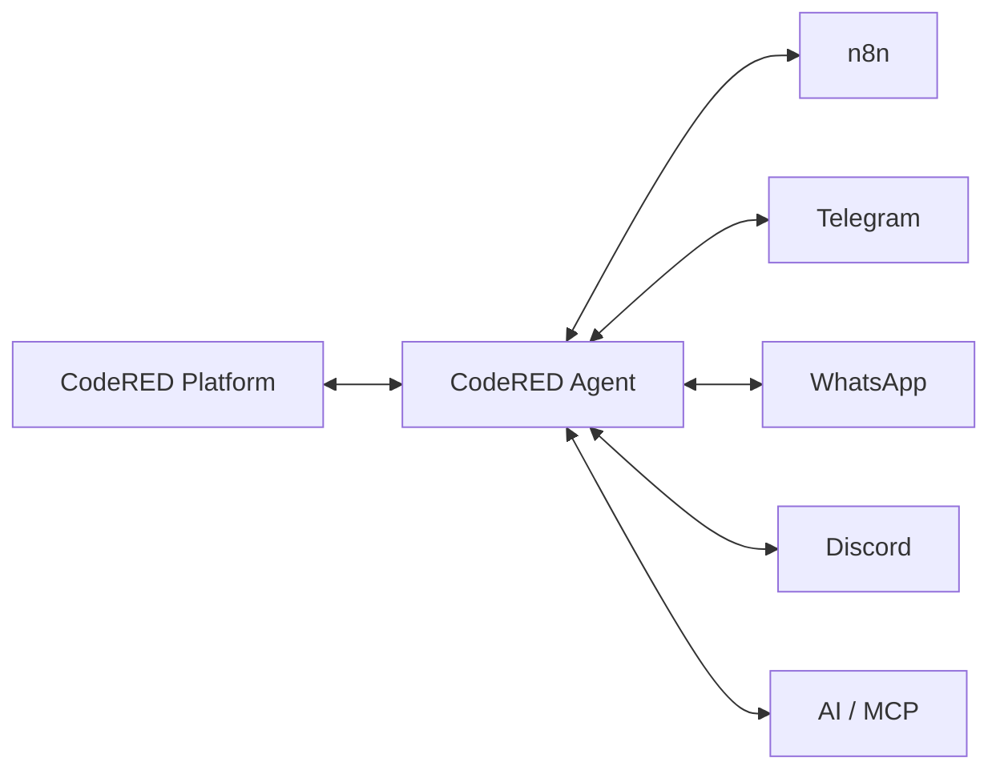

# CodeRED Platform

CodeRED Platform es el centro de control modular para administración y consulta de agencias de Shalom, APIs DNI/RUC, tokens Sanctum e integraciones empresariales. La plataforma combina Laravel 12, Livewire 3, PostgreSQL, Redis, Docker Compose, n8n 2.x y CodeRED Agent para operar Pairing, Discovery, Heartbeat y Capability Registry sin depender de secretos visibles en workflows.

## Capacidades principales

- Gestión administrativa y pública de agencias Shalom.
- APIs versionadas para agencias, DNI y RUC con Sanctum, abilities, rate limiting y documentación OpenAPI.
- Solicitudes de tokens API con aprobación administrativa y auditoría.
- Integración n8n mediante Pairing, Discovery, Heartbeat, Challenge Response y Capability Registry.
- CodeRED Agent como daemon persistente para mantener estado, firmar solicitudes y desacoplar n8n de secretos compartidos.
- Arquitectura extensible para futuros conectores: Telegram, WhatsApp, Discord, IA y MCP.
- Docker Compose con servicios separados para app, Nginx, PostgreSQL, Redis, queue, scheduler, extractor y agente.

## Arquitectura



CodeRED Platform conserva la autoridad de usuarios, permisos, tokens, auditoría y registro de capacidades. CodeRED Agent mantiene la conexión persistente, el estado cifrado local y la comunicación firmada mediante la máquina de estados documentada en `docs/integrations/protocol.md`. n8n y conectores futuros consumen el agente como cliente local, sin exponer el `shared_secret` en outputs.

## Requisitos

- Docker y Docker Compose v2.
- Git.
- OpenSSL para generar secretos seguros.
- DNS público para `APP_URL` y, si se expone, `CODERED_AGENT_PUBLIC_URL`.
- PostgreSQL y Redis mediante los servicios incluidos.
- Cloudflare, red privada o firewall cuando el agente sea accesible desde fuera del host.
- Puertos habituales: `8090` para Nginx local y `5680` para CodeRED Agent ligado por defecto a `127.0.0.1`.

## Instalación

```bash
git clone https://github.com/CodeRED-95/CodeRED-Platform.git
cd CodeRED-Platform
chmod +x Install_CodeRED-Platform.sh
./Install_CodeRED-Platform.sh
```

El instalador configura Laravel, PostgreSQL, Redis, administrador inicial y, opcionalmente, CodeRED Agent. Si se habilita el agente, genera automáticamente `CODERED_AGENT_ENCRYPTION_KEY` y `CODERED_AGENT_LOCAL_API_TOKEN` con `openssl rand -hex 32`, sin mostrarlos en pantalla.

Los seeders de roles y permisos son reejecutables: `RolesAndPermissionsSeeder` puede correrse varias veces durante instalación o recuperación sin duplicar `permission_role` ni borrar relaciones ajenas. Si el seeding falla, el instalador muestra un error explícito y puede reanudarse después de corregir el problema.

## Variables de CodeRED Agent

```env
CODERED_AGENT_NAME="CodeRED n8n Agent"
CODERED_AGENT_PUBLIC_URL=https://agent.codered.host
CODERED_AGENT_ENVIRONMENT=production
CODERED_AGENT_PORT=5680
CODERED_AGENT_DATA_PATH=/data
CODERED_AGENT_ENCRYPTION_KEY=
CODERED_AGENT_LOCAL_API_TOKEN=
CODERED_AGENT_HEARTBEAT_SECONDS=30
CODERED_AGENT_DISCOVERY_SECONDS=300
CODERED_AGENT_REQUEST_TIMEOUT_MS=15000
CODERED_AGENT_LOG_LEVEL=info
```

Genere cada secreto con:

```bash
openssl rand -hex 32
```

Cada valor debe tener 64 caracteres hexadecimales. No comparta `.env`, no suba secretos reales y no cambie `CODERED_AGENT_ENCRYPTION_KEY` sin migrar antes `/data/integration.enc`; de lo contrario, el estado cifrado queda ilegible.

## Comandos principales

```bash
docker compose up -d
docker compose ps
docker compose logs -f
docker compose build codered-agent
docker compose up -d codered-agent
curl http://127.0.0.1:5680/healthz
```


## Base PostgreSQL de n8n

Durante la instalación, `Install_CodeRED-Platform.sh` puede configurar automáticamente PostgreSQL para n8n dentro de `codered-postgres`. El flujo crea o actualiza de forma idempotente el rol `n8n`, la base `n8n`, el propietario, privilegios sobre la base, permisos del esquema `public`, privilegios predeterminados y el archivo de entorno de n8n definido por `N8N_ENV_FILE`.

El instalador solicita la contraseña de `n8n` con entrada oculta y confirmación. Normaliza un par de comillas externas accidentales, no imprime la contraseña y puede ejecutarse nuevamente para rotarla sin borrar datos existentes. El formato correcto es `DB_POSTGRESDB_PASSWORD=valor`, sin comillas añadidas por el instalador.

Para cambiar la contraseña PostgreSQL de n8n, vuelva a ejecutar el instalador y acepte la configuración de n8n, o aplique el mismo flujo: actualizar el rol `n8n`, escribir `/opt/n8n/.env` sin comillas externas y recrear el contenedor con `docker compose up -d --force-recreate`. No use `docker compose down -v`.

Variables relevantes:

```env
N8N_ENV_FILE=/opt/n8n/.env
DB_TYPE=postgresdb
DB_POSTGRESDB_HOST=codered-postgres
DB_POSTGRESDB_PORT=5432
DB_POSTGRESDB_DATABASE=n8n
DB_POSTGRESDB_USER=n8n
DB_POSTGRESDB_PASSWORD=change_me
```
## Actualización

```bash
./update.sh
```

El actualizador crea backup de `.env`, aplica `git pull --ff-only`, agrega variables faltantes del agente sin sobrescribir secretos, reconstruye solo servicios necesarios cuando puede y ejecuta migraciones/cachés Laravel sin borrar volúmenes.

## Administración

```bash
./CodeRED.sh
```

El menú incluye operaciones de plataforma y un submenú de CodeRED Agent para ver estado, logs, reiniciar, reconstruir, probar healthcheck, consultar `/api/v1/status`, generar Pair Codes y rotar el token local. La rotación de la clave de cifrado se bloquea hasta disponer de una utilidad de migración segura de `integration.enc`.

## Seguridad

- No compartir ni versionar `.env`.
- No regenerar `CODERED_AGENT_ENCRYPTION_KEY` sin migración de `integration.enc`.
- No mostrar secretos en outputs de n8n; el modo Legacy queda deprecado.
- Rotar cualquier secreto que haya aparecido en una ejecución n8n.
- Proteger el agente por red privada, firewall o Cloudflare.
- Usar Pairing, HMAC SHA-256, timestamp, nonce y replay protection para integraciones.

## Solución de problemas

- `Missing required configuration: CODERED_AGENT_ENCRYPTION_KEY`: genere un secreto con `openssl rand -hex 32` y persístalo en `.env`.
- `NodeOperationError`: revise `agentBaseUrl`, `localApiToken`, el endpoint local y el cuerpo saneado que ahora conserva código HTTP, operación y causa. n8n no debe esperar `shared_secret` en outputs.
- `Duplicate column`: no edite migraciones antiguas; cree una migración nueva o revise `php artisan migrate:status`.
- `integration.challenge no publicado`: ejecute discovery desde el agente o revise la capacidad `integration.challenge`.
- Heartbeat antiguo: verifique `docker compose logs -f codered-agent` y `/api/v1/status`.
- Discovery vacío: confirme que el agente esté emparejado y que `CODERED_AGENT_PUBLIC_URL` sea accesible por CodeRED Platform.

## Documentación

- [Instalación](docs/INSTALL.md)
- [Entorno](docs/ENVIRONMENT.md)
- [Docker](docs/DOCKER.md)
- [API](docs/API.md)
- [Agencies](docs/AGENCIES.md)
- [API DNI](docs/api/dni.md)
- [API RUC](docs/api/ruc.md)
- [CodeRED Agent: arquitectura](docs/agent/architecture.md)
- [CodeRED Agent: instalación](docs/agent/installation.md)
- [CodeRED Agent: seguridad](docs/agent/security.md)
- [Migración n8n](docs/agent/n8n-migration.md)
- [Changelog](docs/CHANGELOG.md)
- [ADR](docs/adr/README.md)

## Licencia

Proprietary
### Diagnóstico del agente

CodeRED Agent expone tres endpoints locales:

```bash
curl http://127.0.0.1:5680/healthz
curl http://127.0.0.1:5680/readyz
curl -H "Authorization: Bearer $CODERED_AGENT_LOCAL_API_TOKEN" http://127.0.0.1:5680/api/v1/status
```

`/healthz` confirma que el proceso vive. `/readyz` confirma que el servidor cargó configuración y puede estar `paired` o `unpaired`. `/api/v1/status` es la fuente de verdad para n8n: muestra `paired`, `platformConnected`, `instanceId`, `lastHeartbeatAt`, `lastDiscoveryAt`, `capabilities`, `workflows` y `lastError` sin exponer secretos.

Si aparece `Error: Agent is unpaired`, revise que el volumen `codered-agent-data:/data` esté montado y que exista `/data/integration.enc` con permisos restrictivos. El agente ya no debe terminar por ese estado: discovery y heartbeat se omiten hasta completar Pair Instance.


### Integraciones n8n duplicadas

Use `php artisan codered:n8n:deduplicate --dry-run` para auditar duplicados y `php artisan codered:n8n:deduplicate` para revocarlos de forma segura conservando la instancia con actividad más reciente.
