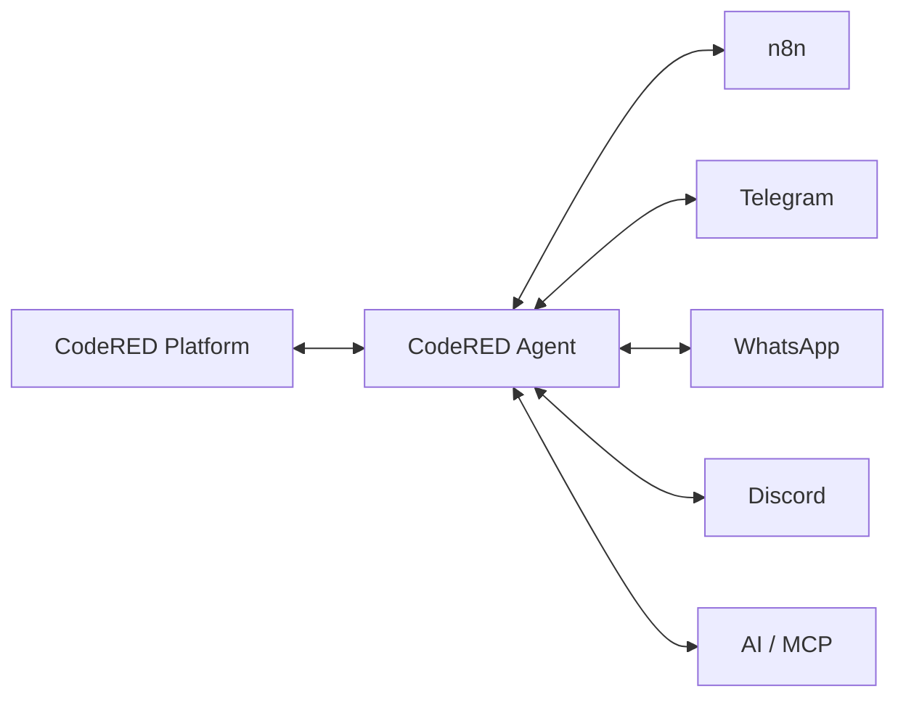

# CodeRED Platform

CodeRED Platform es el centro de control modular para administración y consulta de agencias de Shalom, APIs DNI/RUC, tokens Sanctum e integraciones empresariales. La plataforma combina Laravel 12, Livewire 3, PostgreSQL, Redis, Docker Compose, n8n 2.x y CodeRED Agent para operar Pairing, Discovery, Heartbeat y Capability Registry sin depender de secretos visibles en workflows.

## Versión actual

CodeRED Platform publica la versión `2.2.0` desde una fuente única de configuración. La versión se refleja en el footer del panel web, en `GET /api/v1/version`, en el header `X-Application-Version`, en `php artisan app:version`, en `composer.json > extra.version`, en la documentación de release. La extensión Chrome mantiene su propio versionado en `packages/codered-chrome-extension` y publica `2.3.0`.

```bash
php artisan app:version
curl https://platform.codered.host/api/v1/version
```

Variables opcionales:

```env
APP_VERSION=2.2.0
API_VERSION=v1
```

## ✨ Novedades en esta versión (2.2.0+)

### RUC Import System v3.0 (NUEVO)
- Arquitectura completamente rediseñada con streaming de bajo consumo de memoria
- Importación de archivos ilimitados (testeado hasta 10GB+)
- Event sourcing completo para auditoría
- Progreso en tiempo real mediante broadcasting
- Rollback automático y checkpoints transaccionales
- 10x más rápido que v2.0 (1K → 10K registros/segundo)
- 4x menos memoria (512MB → 128MB pico)

**Próximos pasos si actualizas a v3.0:**
1. Ejecutar `./update.sh` (maneja todas las migraciones automáticamente)
2. Registrar permisos: ver sección "Permisos requeridos (RUC v3.0)"
3. Registrar rutas: ver [DEPLOYMENT_RUC_V3.md](DEPLOYMENT_RUC_V3.md)
4. Leer [RUC_IMPORT_V3_QUICK_START.md](RUC_IMPORT_V3_QUICK_START.md) para empezar

## Capacidades principales

- Gestión administrativa y pública de agencias Shalom.
- APIs versionadas para agencias, DNI y RUC con Sanctum, abilities, rate limiting y documentación OpenAPI.
- **RUC Import System v3.0**: Importación masiva de registros con streaming de bajo consumo de memoria, event sourcing, rollback automático y progreso en tiempo real mediante broadcasting.
- Solicitudes de tokens API con aprobación administrativa y auditoría.
- Integración n8n mediante Pairing, Discovery, Heartbeat, Challenge Response y Capability Registry.
- CodeRED Agent como daemon persistente para mantener estado, firmar solicitudes y desacoplar n8n de secretos compartidos.
- Arquitectura extensible para futuros conectores: Telegram, WhatsApp, Discord, IA y MCP.
- Docker Compose con servicios separados para app, Nginx, PostgreSQL, Redis, queue, scheduler, extractor y agente.

## Arquitectura



CodeRED Platform conserva la autoridad de usuarios, permisos, tokens, auditoría y registro de capacidades. CodeRED Agent mantiene la conexión persistente, el estado cifrado local y la comunicación firmada mediante la máquina de estados documentada en `docs/integrations/protocol.md`. n8n y conectores futuros consumen el agente como cliente local, sin exponer el `shared_secret` en outputs.

## Requisitos

- Docker y Docker Compose v2.
- Git.
- OpenSSL para generar secretos seguros.
- DNS público para `APP_URL` y, si se expone, `CODERED_AGENT_PUBLIC_URL`.
- PostgreSQL y Redis mediante los servicios incluidos.
- Cloudflare, red privada o firewall cuando el agente sea accesible desde fuera del host.
- Puertos habituales: `8090` para Nginx local y `5680` para CodeRED Agent ligado por defecto a `127.0.0.1`.

## Instalación

```bash
git clone https://github.com/CodeRED-95/CodeRED-Platform.git
cd CodeRED-Platform
chmod +x Install_CodeRED-Platform.sh
./Install_CodeRED-Platform.sh
```

El instalador configura Laravel, PostgreSQL, Redis, administrador inicial y, opcionalmente, CodeRED Agent. Si se habilita el agente, genera automáticamente `CODERED_AGENT_ENCRYPTION_KEY` y `CODERED_AGENT_LOCAL_API_TOKEN` con `openssl rand -hex 32`, sin mostrarlos en pantalla.

Los seeders de roles y permisos son reejecutables: `RolesAndPermissionsSeeder` puede correrse varias veces durante instalación o recuperación sin duplicar `permission_role` ni borrar relaciones ajenas. Si el seeding falla, el instalador muestra un error explícito y puede reanudarse después de corregir el problema.

## n8n nativo

n8n es un servicio nativo del compose principal (`codered-n8n`). La imagen local `codered-n8n:2.31.4` se construye desde `docker/n8n/Dockerfile` y compila automaticamente `packages/n8n-nodes-codered`. No existe instalacion independiente en `/opt/n8n`.

Servicios principales:

```text
codered-nginx -> codered-app -> codered-postgres / codered-redis
codered-queue y codered-scheduler usan los mismos servicios base
codered-n8n -> codered-agent -> CodeRED Platform
shalom-extractor queda en la misma red interna
```

Instalacion y actualizacion:

```bash
docker compose up -d --build
```

n8n expone solo `127.0.0.1:5678`, usa el volumen `codered_n8n_data` y se comunica con el Agent mediante `http://codered-agent:5680`.

## Sistema de Importación RUC v3.0

CodeRED Platform v2.2.0+ incluye una arquitectura completamente rediseñada para importación masiva de registros RUC con soporte para archivos ilimitados, progreso en tiempo real y recuperación ante fallos.

### Características principales

- **Streaming con O(1) memoria constante**: Procesa archivos de cualquier tamaño leyendo línea por línea sin cargar en memoria.
- **Event sourcing completo**: Auditoría completa de todas las operaciones registradas en `ruc_import_events`.
- **Detección automática de duplicados**: Tracking de duplicados dentro del archivo y alertas de registros duplicados existentes.
- **Progreso en tiempo real**: Broadcasting mediante canales privados con ETA dinámico y actualización <1s.
- **Rollback automático**: Reversión segura de toda la importación con registro de eventos si falla cualquier paso.
- **Checkpoints transaccionales**: Recuperación ante interrupciones sin pérdida de datos ni duplicados.
- **Validación granular**: Validaciones específicas por línea (RUC, razón social, UBIGEO, etc.) con reportes detallados.
- **Estrategias de merge configurable**: Insert, Insert-Update o Replace con soporte para ON CONFLICT en PostgreSQL.
- **Pausa/Reanudación**: Control administrativo para pausar y reanudar importaciones en progreso.
- **Cancelación segura**: Abortar importaciones manteniendo integridad transaccional.

### Endpoints API

```bash
# Crear importación
POST /admin/ruc/imports
  Parámetros: file, merge_strategy, skip_duplicates, skip_unknown_ubigeo

# Listar importaciones
GET /admin/ruc/imports

# Detalle de importación
GET /admin/ruc/imports/{id}

# Obtener progreso
GET /admin/ruc/imports/{id}/progress

# Controlar importación
POST /admin/ruc/imports/{id}/pause
POST /admin/ruc/imports/{id}/resume
POST /admin/ruc/imports/{id}/cancel
POST /admin/ruc/imports/{id}/rollback

# Descargar errores
GET /admin/ruc/imports/{id}/errors/download
```

### Componentes Livewire

- **ImportManager**: Upload de archivos, selección de estrategia, validación en cliente.
- **ImportMonitor**: Progreso en tiempo real, barra animada, ETA dinámico, botones de control.

### Documentación RUC v3.0

- [Implementación completa](RUC_IMPORT_V3_IMPLEMENTATION.md) — Guía exhaustiva de 2,500+ palabras
- [Inicio rápido](RUC_IMPORT_V3_QUICK_START.md) — Configuración en 60 segundos
- [Changelog](RUC_IMPORT_V3_CHANGELOG.md) — Cambios y benchmarks
- [Despliegue](DEPLOYMENT_RUC_V3.md) — Guía de actualización con 12 pasos
- [Checklist](RUC_IMPORT_V3_CHECKLIST.md) — Validación de despliegue

### Ejemplo: Importar archivo RUC

```bash
# Usando curl
curl -X POST http://platform.codered.host/admin/ruc/imports \
  -H "Authorization: Bearer YOUR_TOKEN" \
  -F "file=@registros.csv" \
  -F "merge_strategy=insert_update" \
  -F "skip_duplicates=true"

# Resultado
{
  "id": 123,
  "status": "processing",
  "total_lines": 50000,
  "progress_url": "/admin/ruc/imports/123/progress",
  "created_at": "2026-08-06T20:39:00Z"
}
```

### Monitoreo de importaciones

```bash
# Ver progreso en tiempo real
docker compose exec -T app php artisan tinker
>>> RucImport::find(123)->with('events', 'duplicates', 'errors')->get()

# Ver logs de importación
docker compose logs -f codered-queue | grep -i "ruc"

# Cancelar importación (si es necesario)
docker compose exec -T app php artisan ruc:cancel-import 123
```

## Variables de CodeRED Agent

```env
CODERED_AGENT_NAME="CodeRED n8n Agent"
CODERED_AGENT_PUBLIC_URL=https://agent.codered.host
CODERED_AGENT_ENVIRONMENT=production
CODERED_AGENT_PORT=5680
CODERED_AGENT_DATA_PATH=/data
CODERED_AGENT_ENCRYPTION_KEY=
CODERED_AGENT_LOCAL_API_TOKEN=
CODERED_AGENT_HEARTBEAT_SECONDS=30
CODERED_AGENT_DISCOVERY_SECONDS=300
CODERED_AGENT_REQUEST_TIMEOUT_MS=15000
CODERED_AGENT_LOG_LEVEL=info
```

Genere cada secreto con:

```bash
openssl rand -hex 32
```

Cada valor debe tener 64 caracteres hexadecimales. No comparta `.env`, no suba secretos reales y no cambie `CODERED_AGENT_ENCRYPTION_KEY` sin migrar antes `/data/integration.enc`; de lo contrario, el estado cifrado queda ilegible.

## Comandos principales

```bash
docker compose up -d
docker compose ps
docker compose logs -f
docker compose build codered-agent
docker compose up -d codered-agent
curl http://127.0.0.1:5680/healthz
```


## Base PostgreSQL de n8n

Durante la instalacion, `Install_CodeRED-Platform.sh` configura automaticamente PostgreSQL para n8n dentro de `codered-postgres`. El flujo crea o actualiza de forma idempotente el rol `n8n`, la base `n8n`, propietario y privilegios, y escribe `N8N_DB_*` en el `.env` principal.

El instalador genera `N8N_DB_PASSWORD` si falta, no lo imprime y puede ejecutarse nuevamente para rotarlo sin borrar datos existentes. Para cambios manuales, actualice el rol PostgreSQL, cambie `N8N_DB_PASSWORD` en `.env` y recree `codered-n8n` con `docker compose up -d --force-recreate codered-n8n`. No use `docker compose down -v`.

Variables relevantes:

```env
N8N_DB_DATABASE=n8n
N8N_DB_USERNAME=n8n
N8N_DB_PASSWORD=
N8N_ENCRYPTION_KEY=
N8N_HOST=n8n.codered.host
N8N_EDITOR_BASE_URL=https://n8n.codered.host/
N8N_WEBHOOK_URL=https://n8n.codered.host/
```
## Webhook de nuevas solicitudes de token

CodeRED Platform v2.2.0 notifica a n8n cada vez que se crea una solicitud nueva de token. El flujo es: Platform crea la solicitud, dispara `TokenRequestCreated` después del commit, un listener en cola envía un webhook HMAC a n8n y el workflow `CodeRED — Nueva solicitud de token` envía el aviso por Telegram.

Variables requeridas:

```env
N8N_TOKEN_REQUEST_NOTIFICATIONS=true
N8N_TOKEN_REQUEST_WEBHOOK_URL=https://n8n.codered.host/webhook/codered-token-request
N8N_TOKEN_REQUEST_WEBHOOK_SECRET=VALOR_GENERADO
N8N_TOKEN_REQUEST_WEBHOOK_TIMEOUT=10
```

Genere el secreto con `openssl rand -hex 32`. El webhook recibe solo contacto enmascarado, código de seguimiento, solicitante, aplicación, integración, estado y URL administrativa; no recibe tokens, contactos completos, IP, user agent, firma ni secreto.

## Operaciones CodeRED en n8n

El nodo CodeRED se organiza en dos recursos:

- **Connection**: Pair Instance, Test Connection, Reconnect, Get Agent Status, Refresh Discovery, Rotate Secret y Disconnect.
- **Token Requests**: Create Token Request, Get Token Request Status, Retrieve Approved Token, Confirm Token Delivery y Cancel Token Request.

El flujo funcional recomendado es crear la solicitud desde n8n, aprobarla en el panel administrativo de CodeRED Platform, consultar el estado, recuperar el token aprobado una sola vez y confirmar la entrega. El token aprobado solo aparece como salida de `Retrieve Approved Token`; no se guarda en credenciales, logs, metadata ni errores. Todas las operaciones pasan por `codered-agent`, que firma las solicitudes hacia Platform con la identidad emparejada.

La aprobación administrativa y la generación manual muestran solo tres tipos de token: **DNI**, **RUC** y **AGENCIAS**. Internamente siguen usando abilities Sanctum canonicas: DNI => `dni:consultar`; RUC => `ruc:consultar`, `ruc:buscar`; AGENCIAS => `agencias:consultar`, `agencies:read`, `agencies:map`. n8n puede enviar `requested_token_type` como preferencia (`dni`, `ruc` o `agencies`), pero la decision final y la generacion del token pertenecen al administrador en Platform. Las solicitudes antiguas sin tipo siguen siendo validas y se aprueban eligiendo un tipo en el panel. La vigencia final del token se expresa en días con rango de 1 a 365 y valor predeterminado de 30; Platform calcula `personal_access_tokens.expires_at` en un servicio central. `approval_timeout_minutes` sigue existiendo solo para caducar solicitudes pendientes, mientras que `expires_in_minutes` queda como campo legacy de n8n y se redondea hacia arriba a días.

Para actualizar solo los servicios afectados después de cambios en el nodo o agente:

```bash
docker compose build codered-agent codered-n8n
docker compose up -d --force-recreate codered-agent codered-n8n
```

Para comprobar que n8n está cargando la versión nueva del nodo:

```bash
docker exec codered-n8n sh -lc 'ls -lah /home/node/.n8n/custom/n8n-nodes-codered/dist/nodes/CodeRED && grep -R "createTokenRequest\|token-requests" -n /home/node/.n8n/custom/n8n-nodes-codered/dist/nodes/CodeRED'
```
## Extensión Buscador Shalom

La extensión `packages/codered-chrome-extension` usa versionado propio y publica `2.3.0`. El popup fue reconstruido como un panel oscuro compacto de una sola columna y 360 px: muestra estado del token, token enmascarado, última sincronización, agencias disponibles, estado de conexión y sincronización automática. Solo permite solicitar token, configurar token y probar conexión; la búsqueda de agencias permanece únicamente dentro de Shalom Control.

El botón **Solicitar token** abre `https://platform.codered.host/solicitar-token` sin enviar secretos. El botón **Configurar token** abre Options para guardar, probar, sincronizar o eliminar el token. El token se enmascara siempre y la clave canónica de storage es `codered_api_token`.

Para validar el build de la extensión:

```bash
cd packages/codered-chrome-extension
npm run build:extension
node --check dist/content.js
grep -RInE '^[[:space:]]*(import|export)[[:space:]]' dist/content.js
```

La carga manual se realiza desde `chrome://extensions` seleccionando únicamente `packages/codered-chrome-extension/dist` como extensión descomprimida.

## Páginas legales para la extensión de Chrome

Para cumplir con los requisitos de la Chrome Web Store, se han creado dos páginas públicas:

- **Política de Privacidad:** `https://platform.codered.host/privacy/buscador-shalom`
- **Soporte:** `https://platform.codered.host/support/buscador-shalom`

Estas páginas no requieren autenticación y están diseñadas para ser responsive y consistentes con el branding de CodeRED Platform.

### Variables de entorno

Las siguientes variables de entorno se utilizan para configurar el contenido de las páginas legales:

```env
CODERED_SUPPORT_EMAIL=support@codered.host
CODERED_LEGAL_NAME="CodeRED Platform"
CODERED_LEGAL_COUNTRY="Perú"
CODERED_PRIVACY_UPDATED_AT=2026-08-02
```

### Limpieza de caché

Si modifica estas variables en su archivo `.env`, asegúrese de limpiar la caché de configuración para que los cambios se reflejen:

```bash
php artisan optimize:clear
php artisan config:cache
```

## Actualización

```bash
./update.sh
```

El actualizador crea backup de `.env`, aplica `git pull --ff-only`, agrega variables faltantes del agente sin sobrescribir secretos, reconstruye solo servicios necesarios cuando puede y ejecuta migraciones/cachés Laravel sin borrar volúmenes.

## Administración

```bash
./CodeRED.sh
```

El menú incluye operaciones de plataforma y un submenú de CodeRED Agent para ver estado, logs, reiniciar, reconstruir, probar healthcheck, consultar `/api/v1/status`, generar Pair Codes y rotar el token local. La rotación de la clave de cifrado se bloquea hasta disponer de una utilidad de migración segura de `integration.enc`.

## Permisos requeridos (RUC v3.0)

Para usar el nuevo sistema de importación RUC v3.0, registre estos permisos en su tabla de permisos:

```php
// app/Providers/AuthServiceProvider.php
use App\Modules\Ruc\Models\RucImport;
use App\Modules\Ruc\Policies\RucImportPolicy;

public function boot()
{
    Gate::policy(RucImport::class, RucImportPolicy::class);
    
    // Permisos (registrar en BD también)
    // 'ruc.import.create'      - Crear nuevas importaciones
    // 'ruc.import.view'        - Ver importaciones
    // 'ruc.import.pause'       - Pausar importaciones
    // 'ruc.import.resume'      - Reanudar importaciones
    // 'ruc.import.cancel'      - Cancelar importaciones
    // 'ruc.import.rollback'    - Revertir importaciones
    // 'ruc.import.viewErrors'  - Ver errores de importación
}
```

## Seguridad

- No compartir ni versionar `.env`.
- No regenerar `CODERED_AGENT_ENCRYPTION_KEY` sin migración de `integration.enc`.
- No mostrar secretos en outputs de n8n; el modo Legacy queda deprecado.
- Rotar cualquier secreto que haya aparecido en una ejecución n8n.
- Proteger el agente por red privada, firewall o Cloudflare.
- Usar Pairing, HMAC SHA-256, timestamp, nonce y replay protection para integraciones.

## Solución de problemas

- `Missing required configuration: CODERED_AGENT_ENCRYPTION_KEY`: genere un secreto con `openssl rand -hex 32` y persístalo en `.env`.
- `NodeOperationError`: revise `agentBaseUrl`, `localApiToken`, el endpoint local y el cuerpo saneado que ahora conserva código HTTP, operación y causa. n8n no debe esperar `shared_secret` en outputs.
- `Duplicate column`: no edite migraciones antiguas; cree una migración nueva o revise `php artisan migrate:status`.
- `integration.challenge no publicado`: ejecute discovery desde el agente o revise la capacidad `integration.challenge`.
- Heartbeat antiguo: verifique `docker compose logs -f codered-agent` y `/api/v1/status`.
- Discovery vacío: confirme que el agente esté emparejado y que `CODERED_AGENT_PUBLIC_URL` sea accesible por CodeRED Platform.

## Documentación

### Documentación general
- [Instalación](docs/INSTALL.md)
- [Entorno](docs/ENVIRONMENT.md)
- [Docker](docs/DOCKER.md)
- [API](docs/API.md)
- [Agencies](docs/AGENCIES.md)
- [Changelog](docs/CHANGELOG.md)
- [ADR](docs/adr/README.md)

### APIs
- [API DNI](docs/api/dni.md)
- [API RUC](docs/api/ruc.md)

### RUC Import System v3.0
- [Implementación completa](RUC_IMPORT_V3_IMPLEMENTATION.md)
- [Inicio rápido](RUC_IMPORT_V3_QUICK_START.md)
- [Changelog v3.0](RUC_IMPORT_V3_CHANGELOG.md)
- [Despliegue](DEPLOYMENT_RUC_V3.md)
- [Checklist](RUC_IMPORT_V3_CHECKLIST.md)
- [Auditoría v2.0](RUC_IMPORT_AUDIT.md)
- [Arquitectura v3.0](RUC_IMPORT_NEW_ARCHITECTURE.md)

### CodeRED Agent
- [Arquitectura](docs/agent/architecture.md)
- [Instalación](docs/agent/installation.md)
- [Seguridad](docs/agent/security.md)
- [Migración n8n](docs/agent/n8n-migration.md)

## Actualización rápida (recomendado)

```bash
cd ~/CodeRED-Platform
git pull origin main
./update.sh
```

El script `update.sh` automatiza todos los pasos: backup de `.env`, construcción selectiva de imágenes, levantamiento de servicios, migraciones, cachés y verificación de salud. Vea [DEPLOYMENT_RUC_V3.md](DEPLOYMENT_RUC_V3.md) para detalles completos.

## Actualización manual (solo si necesitas control granular)

```bash
cd ~/CodeRED-Platform
git pull
git checkout main
docker compose build --no-cache
docker compose up -d
docker compose exec -T app php artisan migrate --force
docker compose exec -T app php artisan optimize:clear
docker compose exec -T app php artisan config:cache
docker compose exec -T app php artisan route:cache
docker compose exec -T app php artisan view:cache
docker compose exec -T app php artisan queue:restart
docker compose exec -T app php artisan app:version
docker compose restart codered-nginx
docker compose restart codered-agent
```

## Licencia

Proprietary
### Diagnóstico del agente

CodeRED Agent expone tres endpoints locales:

```bash
curl http://127.0.0.1:5680/healthz
curl http://127.0.0.1:5680/readyz
curl -H "Authorization: Bearer $CODERED_AGENT_LOCAL_API_TOKEN" http://127.0.0.1:5680/api/v1/status
```

`/healthz` confirma que el proceso vive. `/readyz` confirma que el servidor cargó configuración y puede estar `paired` o `unpaired`. `/api/v1/status` es la fuente de verdad para n8n: muestra `paired`, `platformConnected`, `instanceId`, `lastHeartbeatAt`, `lastDiscoveryAt`, `capabilities`, `workflows` y `lastError` sin exponer secretos.

Si aparece `Error: Agent is unpaired`, revise que el volumen `codered-agent-data:/data` esté montado y que exista `/data/integration.enc` con permisos restrictivos. El agente ya no debe terminar por ese estado: discovery y heartbeat se omiten hasta completar Pair Instance.


### Integraciones n8n duplicadas

Use `php artisan codered:n8n:deduplicate --dry-run` para auditar duplicados y `php artisan codered:n8n:deduplicate` para revocarlos de forma segura conservando la instancia con actividad más reciente.

### Rotación segura de tokens

CodeRED Platform soporta solicitudes de rotación además de generación inicial. Una rotación se crea desde un token Sanctum autenticado mediante `POST /api/v1/token-requests/rotation`; Platform obtiene el token fuente desde el contexto autenticado, no desde un ID enviado por el cliente. Mientras la solicitud está pendiente, el token anterior sigue activo. Al aprobarse desde el panel, la operación bloquea la solicitud y el token fuente, genera un reemplazo con el mismo propietario, tipo, scopes y `expires_at`, revoca el token anterior con `revoked_at` y deja el nuevo token listo para recuperación única.

La UI distingue "Generación" y "Rotación". En rotaciones no se permite editar tipo, scopes ni vigencia: todos esos valores se heredan del token original. n8n expone "Request Token Rotation" y envía el token actual al CodeRED Agent local, que lo reenvía como Bearer a Platform sin registrarlo.

## Telegram: código personal y rotación de tokens

CodeRED Platform soporta dos comandos de Telegram operados desde n8n y `codered-agent`:

- `/codigo`: consulta el código personal UUID vinculado al usuario de Telegram.
- `/rotar a6759c4f-f6cc-4a1a-b639-3869f6894ada | Cambio trimestral`: registra una solicitud administrativa de rotación.

El código personal se guarda en `users.public_code`, es opaco, único, no secuencial y no es un token de acceso. La vinculación de Telegram se crea cuando una solicitud de token originada en Telegram/n8n es aprobada por un administrador; no se crea un perfil solo por consultar `/codigo`.

La rotación por Telegram no recibe el token actual. Platform valida `person_code`, `telegram_user_id`, `telegram_chat_id`, la integración HMAC emparejada y que exista exactamente un token activo elegible. Si hay más de un token activo, la rotación debe seleccionarse desde el panel administrativo. Mientras la solicitud está pendiente, el token anterior sigue funcionando; al aprobarse, la transacción genera el reemplazo, conserva propietario, scopes, tipo y `expires_at`, y recién entonces revoca el token anterior.

Endpoints firmados usados por `codered-agent`:

- `POST /api/v1/integrations/n8n/personal-code`
- `POST /api/v1/integrations/n8n/token-requests/rotation-by-code`

El nodo `CUSTOM.codeRed` agrega:

- `Personal / Get Personal Code`
- `Token Requests / Request Token Rotation`

El workflow importable de referencia está en `docs/integrations/workflows/telegram-code-rotation.workflow.json`. Después de registrar una rotación, el flujo puede reutilizar `Get Token Request Status`, `Retrieve Approved Token` y `Confirm Token Delivery` para entregar el reemplazo una sola vez y cerrar el ciclo.

## Solicitud pública de tokens

La ruta `GET /solicitar-token` permite solicitar un token de acceso sin iniciar sesión. Usa un layout público aislado, mantiene CSRF, aplica rate limit específico, honeypot y deduplicación de solicitudes pendientes por huella HMAC de contacto, instalación e integración. El formulario crea solicitudes `pending` en el panel administrativo de solicitudes de tokens y nunca muestra el token al solicitante.

El administrador revisa la solicitud en `/admin/security/token-requests`, aprueba con el tipo AGENCIAS y Platform genera un token Sanctum con ability mínima `agencies:read`. El token plano se cifra temporalmente para entrega segura mediante n8n o flujo manual; no se publica en URL, logs ni página pública.

### Entrega segura de tokens


### Panel administrativo de solicitudes de token

La vista `Seguridad > Solicitudes de tokens` usa un dashboard oscuro con métricas de estado, filtros por solicitante, estado, entrega, scope, revisor y fecha, tabla paginada de 5 registros y panel lateral de ayuda. Cada solicitud abre un modal de detalle con información, datos de entrega protegidos, notificaciones n8n/Telegram e historial.

Las solicitudes no entregadas pueden eliminarse solo con el permiso `api-token-requests.delete` y una confirmación explícita. Las solicitudes entregadas no pueden eliminarse desde el panel ni desde backend para conservar la trazabilidad de entrega.

El panel administrativo de solicitudes de token conserva los datos completos de entrega cifrados y no los renderiza inicialmente. Un administrador con `api-token-requests.view-delivery-contact` puede revelarlos manualmente antes de la entrega; la visualización queda auditada. Al confirmar la entrega, los datos completos se eliminan y solo permanecen valores enmascarados.

## Comandos Docker para aplicar notificaciones n8n

```bash
cd ~/CodeRED-Platform
git pull

# Configurar .env antes de levantar servicios
openssl rand -hex 32

docker compose up -d --build
docker exec codered-app php artisan migrate --force
docker exec codered-app php artisan optimize:clear
docker exec codered-app php artisan config:cache
docker exec codered-app php artisan route:cache
docker exec codered-app php artisan view:cache
docker exec codered-app php artisan queue:restart

docker restart codered-nginx
docker restart codered-agent

docker compose ps
docker logs --tail=100 codered-app
docker logs --tail=100 codered-queue
docker logs --tail=100 codered-nginx
```
