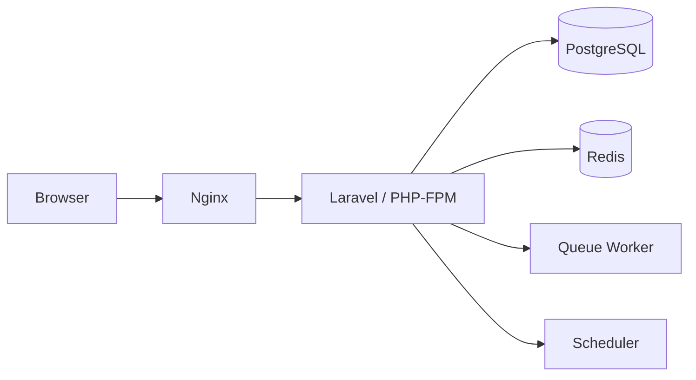
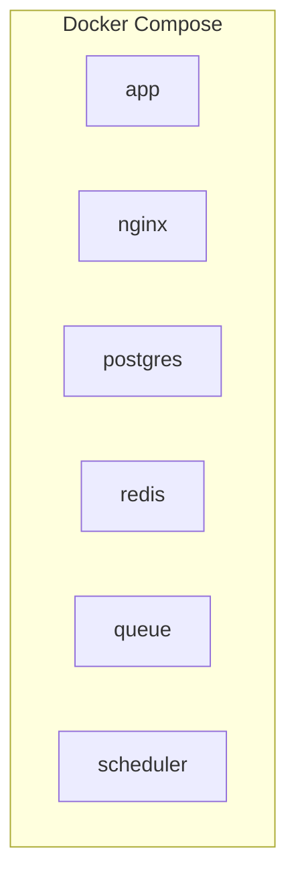
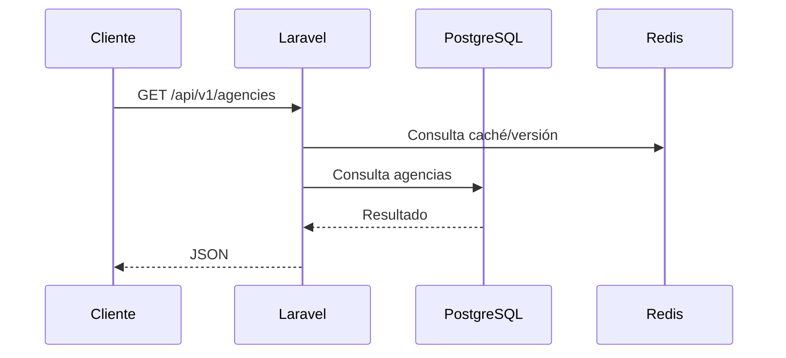
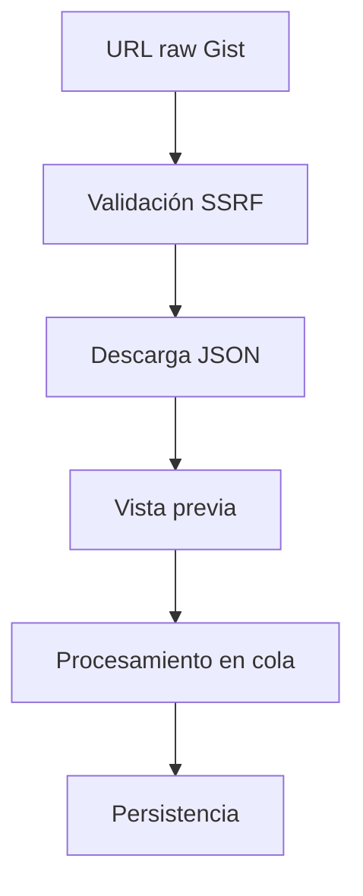
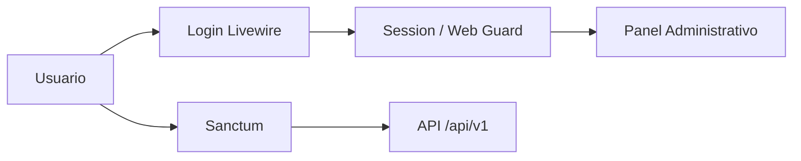
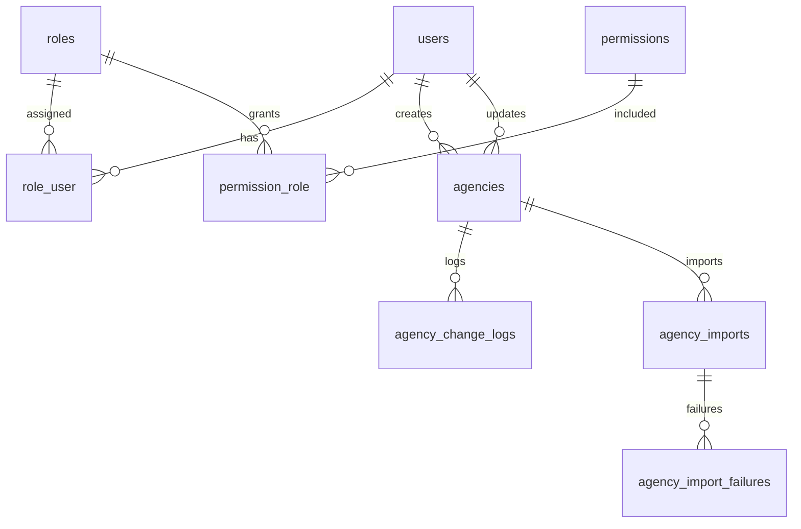
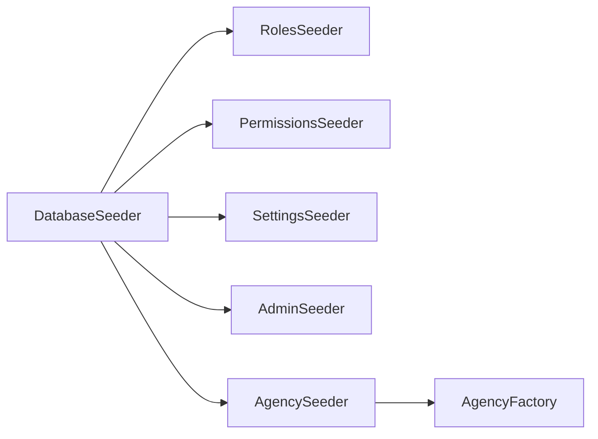
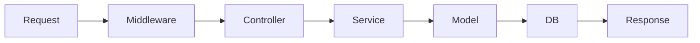

# Arquitectura

## Resumen

La aplicación se organiza por dominios en:

- `app/Core`
- `app/Modules`
- `app/Modules/Agencies`

## Diagrama general

## Docker

## Flujo API

## Importador

## Autenticación

## Base de datos

## Factories y seeders

Los modelos modulares que usan factories centralizadas en `database/factories` deben implementar `newFactory()` para no depender de la inferencia automática.

## Flujo de solicitudes

## Extensión Chrome

La extensión Chrome todavía no está implementada.

PENDIENTE DE CONFIGURAR
