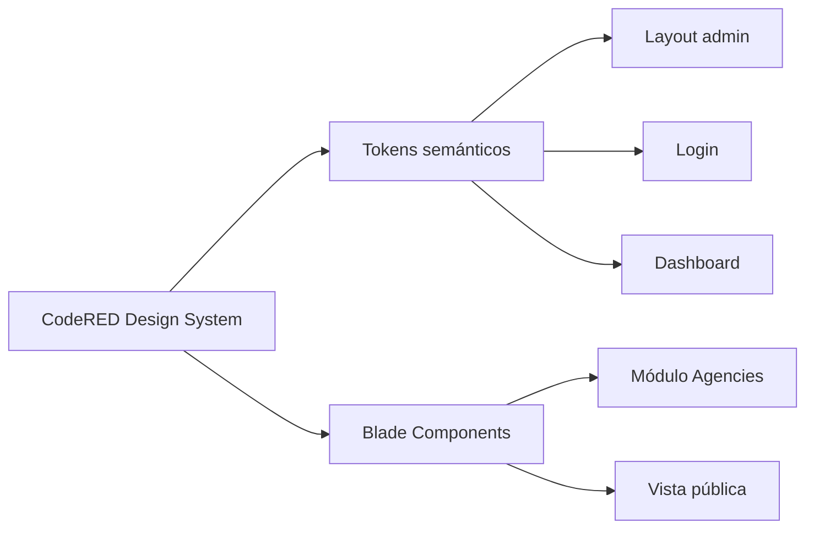
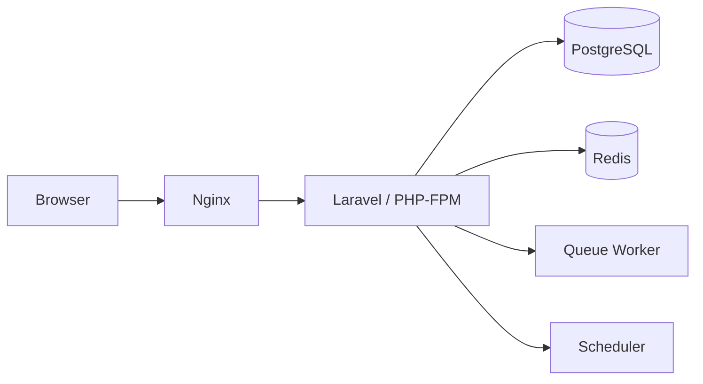
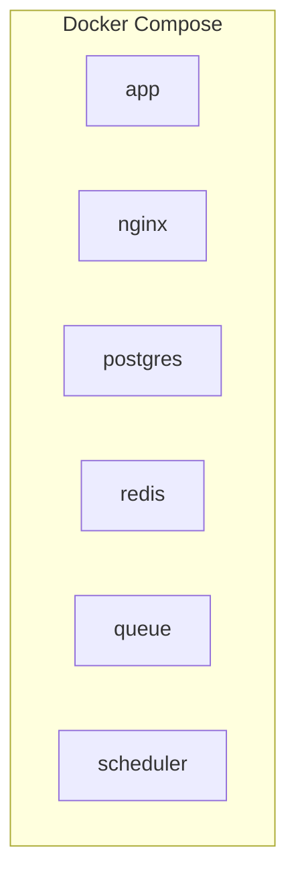
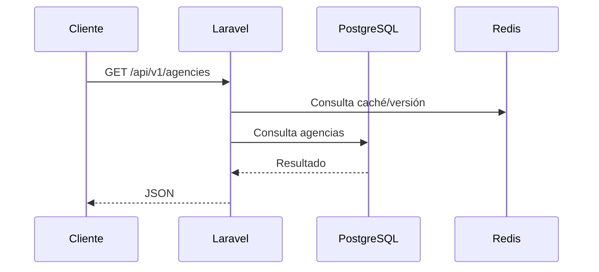
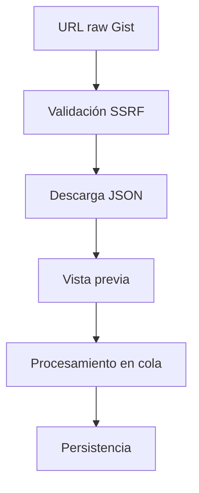
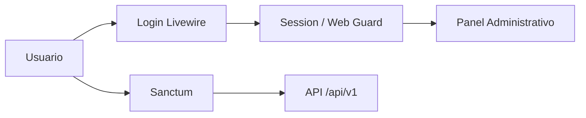
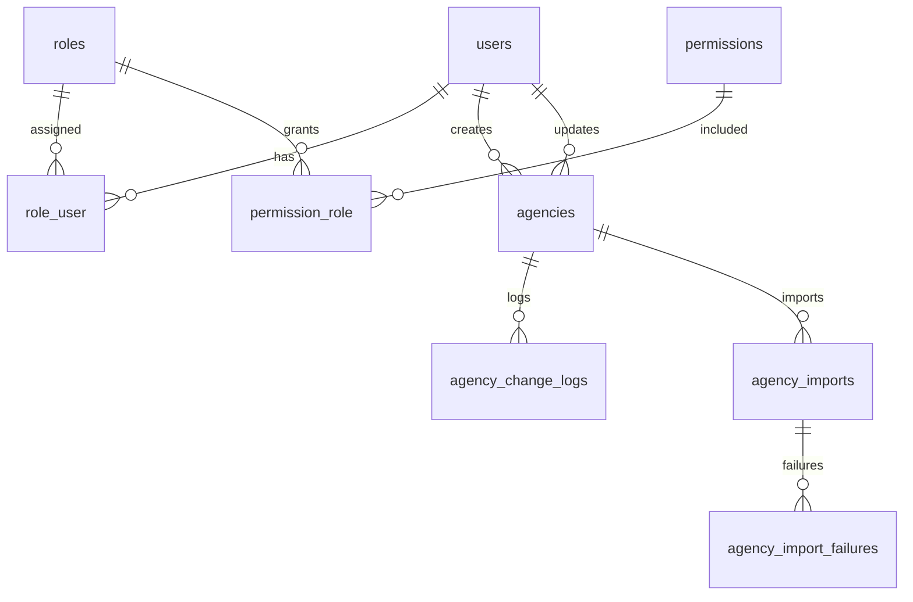
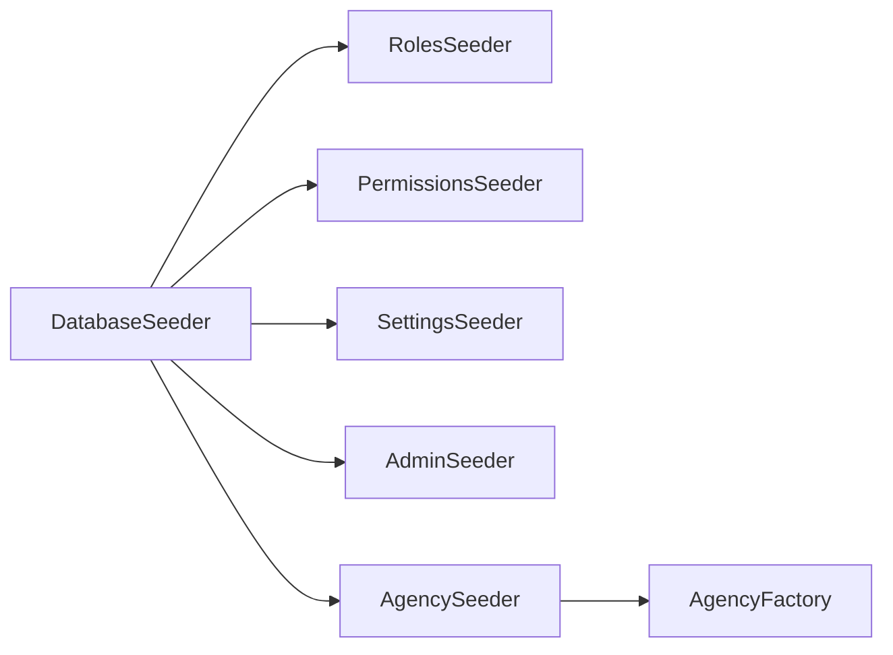
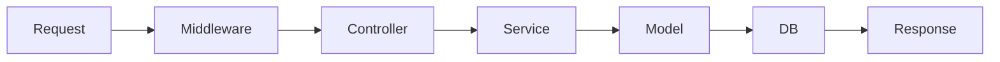

# Arquitectura

## Resumen

La aplicación se organiza por dominios en:

- `app/Core`
- `app/Modules`
- `app/Modules/Agencies`
- `resources/views/components/ui`

## Design System

El diseño visual se centraliza en tokens CSS y componentes Blade compartidos para evitar estilos dispersos.

## Diagrama general

## Docker

## Flujo API

### Sincronización incremental de agencias

El catálogo público autenticado se sincroniza mediante un changelog append-only independiente de la auditoría administrativa. `agency_sync_changes.id` es la secuencia monotónica; los cursores opacos están firmados con HMAC y contienen esa secuencia y la versión del esquema. El observer de `Agency` escribe eventos `upsert` o `delete` dentro de la misma transacción del cambio. `agency_sync_states` conserva el watermark de retención para detectar cursores vencidos y exigir una sincronización completa. Véase [ADR 0032](adr/0032-agency-incremental-sync-changelog.md).

## Importador

## Autenticación

## Base de datos

## Factories y seeders

Los modelos modulares que usan factories centralizadas en `database/factories` deben implementar `newFactory()` para no depender de la inferencia automática.

## Flujo de solicitudes

## Extensión Chrome

La extensión Chrome todavía no está implementada.

PENDIENTE DE CONFIGURAR
