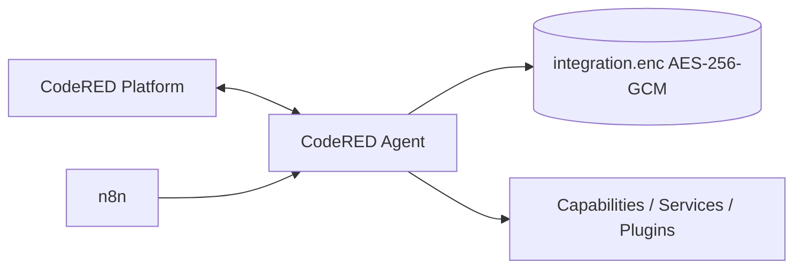

# Arquitectura CodeRED Agent

CodeRED Platform es el centro de control. CodeRED Agent mantiene el estado persistente, firma solicitudes, publica discovery y heartbeat. n8n pasa a ser cliente del agente.

