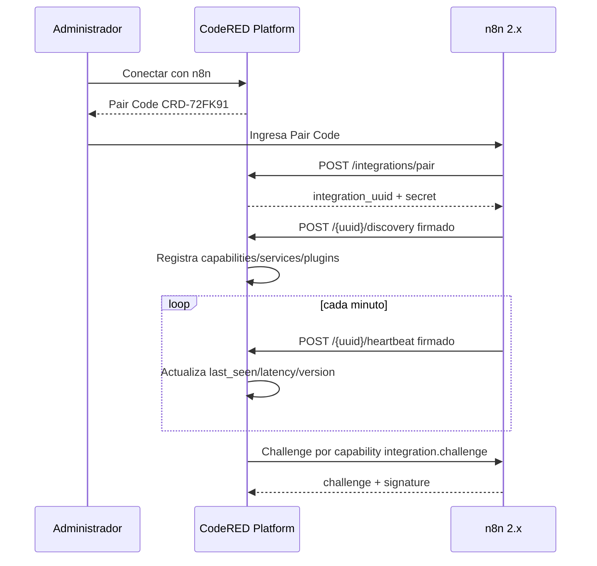

# Protocolo empresarial de integraciones CodeRED

CodeRED Platform expone una base extensible para conectores externos. n8n es el primer conector, pero el protocolo está diseñado para WhatsApp, Discord, IA, MCP y futuros plugins.

## Principios

- No configurar manualmente URLs de webhook ni secretos compartidos.
- No depender de nombres de rutas ni de workflows.
- Registrar servicios mediante identificadores lógicos.
- Permitir múltiples instancias independientes.
- Mantener heartbeat, discovery y logs auditables.
- No mostrar secretos en Blade, JavaScript, logs ni respuestas no iniciales.

## Componentes

- Pairing: CodeRED genera `pair_uuid`, `pair_code`, secreto temporal, nonce y expiración de 10 minutos.
- Discovery: la instancia registra capabilities, services y plugins.
- Heartbeat: n8n reporta estado cada minuto.
- Capability Registry: CodeRED resuelve servicios lógicos hacia endpoints actuales.

## Pairing

En `Integraciones > n8n`, el administrador pulsa `Conectar con n8n`. CodeRED muestra solo:

```text
Código: CRD-72FK91
Duración: 10 minutos
Estado: Pendiente
```

El secreto temporal se guarda cifrado y nunca se muestra.

n8n ejecuta el workflow `CodeRED Pairing` y pide solo el código. Luego llama:

```http
POST /api/v1/integrations/pair
```

```json
{
  "pair_code": "CRD-72FK91",
  "instance_name": "n8n Production",
  "instance_url": "https://n8n.codered.lat",
  "version": "2.31.4",
  "hostname": "codered",
  "environment": "production"
}
```

CodeRED responde una sola vez con `integration_uuid`, secreto definitivo y URLs de discovery/heartbeat. n8n debe guardar el secreto como credencial segura.

## API Discovery de CodeRED

```http
GET /api/v1/integrations/discovery
```

```json
{
  "version": "1.0",
  "protocol": "codered.integration.discovery",
  "required_capabilities": [
    "token.request.created",
    "token.request.approved",
    "heartbeat"
  ],
  "security": {
    "hmac": "sha256",
    "timestamp_tolerance_seconds": 300,
    "nonce": "required"
  }
}
```

## Registro Discovery desde n8n

Todas las llamadas firmadas usan:

```text
X-CodeRED-Integration: {integration_uuid}
X-CodeRED-Timestamp: unix timestamp
X-CodeRED-Nonce: uuid
X-CodeRED-Signature: hmac_sha256(timestamp + "." + nonce + "." + raw_body)
```

```http
POST /api/v1/integrations/{integration_uuid}/discovery
```

```json
{
  "version": "1.0",
  "capabilities": {
    "new_request": {
      "service": "token.request.created",
      "path": "/webhook/codered-new-token-request",
      "method": "POST",
      "version": "1.0"
    },
    "token_status": {
      "service": "token.request.approved",
      "path": "/webhook/codered-token-status-v2",
      "method": "POST",
      "version": "2.0"
    },
    "delivery_confirmation": {
      "service": "token.delivery.confirmed",
      "path": "/webhook/codered-delivery-confirmation",
      "method": "POST",
      "version": "1.0"
    },
    "challenge": {
      "service": "integration.challenge",
      "path": "/webhook/codered-challenge",
      "method": "POST",
      "version": "1.0"
    }
  },
  "services": {
    "telegram": {"enabled": true},
    "whatsapp": {"enabled": false},
    "discord": {"enabled": true},
    "ai": {"enabled": true},
    "mcp": {"enabled": false}
  },
  "plugins": [
    {"id": "telegram-token", "name": "Telegram Token Requests", "version": "1.0"},
    {"id": "ai-agent", "name": "AI Agent", "version": "2.3"}
  ]
}
```

CodeRED actualiza `integration_capabilities`, `integration_services` e `integration_plugins`. Si `/webhook/token-status` cambia a `/webhook/token-status-v2`, n8n vuelve a publicar discovery y CodeRED actualiza el checksum sin intervención manual.

## Heartbeat

n8n llama cada minuto:

```http
POST /api/v1/integrations/{integration_uuid}/heartbeat
```

```json
{
  "integration_uuid": "...",
  "uptime": 12345,
  "version": "2.31.4",
  "running_workflows": 6,
  "memory_usage": 123,
  "cpu_usage": 15,
  "hostname": "codered",
  "environment": "production"
}
```

CodeRED guarda `last_seen_at`, `latency_ms`, `version`, `uptime`, workflows, memoria, CPU, host y entorno. Una instancia se considera online si el último heartbeat ocurrió hace menos de 3 minutos.

## Challenge Response

La prueba de conexión no acepta solo HTTP 200. CodeRED llama la capability lógica `integration.challenge` con:

```json
{"challenge": "abc123"}
```

n8n responde:

```json
{
  "challenge": "abc123",
  "signature": "hmac_sha256(challenge, secret)"
}
```

CodeRED muestra latencia y resultado.

## Reconexión

`Reconectar` genera un nuevo Pair Code asociado a la instancia existente. No borra logs, tokens, capabilities ni historial. Cuando n8n reclama el código, CodeRED actualiza la instancia.

## Rotación de secreto

`Regenerar secreto` crea un secreto nuevo, lo guarda cifrado e invalida el anterior. El endpoint firmado:

```http
POST /api/v1/integrations/{integration_uuid}/secret/rotate
```

permite que n8n reciba el nuevo secreto por canal autenticado. La operación se registra como `Secret Rotation`.

## Logs

`integration_logs` registra:

- Pairing
- Connected
- Disconnected
- Heartbeat
- Discovery
- Secret Rotation
- Webhook Updated
- Reconnect
- Challenge
- Errors

Nunca se guardan secretos, tokens planos ni encabezados completos.

## Diagrama



## Auto Upgrade

CodeRED compara `required_capabilities` y versiones publicadas por n8n. Si una capability requerida falta o tiene versión antigua, el panel muestra que hay nuevas capacidades disponibles para actualizar la integración.