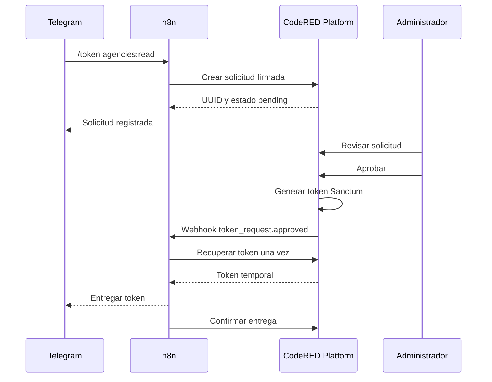

# Solicitudes de tokens API con n8n y Telegram

CodeRED Platform permite recibir solicitudes de tokens Sanctum desde Telegram mediante n8n, dejarlas en estado pendiente y exigir aprobación manual antes de generar la credencial.

## Arquitectura

- Telegram recibe comandos como `/token agencies:read`.
- n8n valida el comando y llama a CodeRED Platform con firma HMAC.
- CodeRED Platform crea una `api_token_requests` en estado `pending`.
- Un administrador aprueba o rechaza desde `Seguridad > Solicitudes de tokens`.
- Si se aprueba, se genera un token Sanctum dentro de una transacción y el `plainTextToken` se cifra temporalmente con `Crypt::encryptString()`.
- n8n recibe un webhook de estado, consulta `retrieve`, entrega el token por Telegram y confirma la entrega.
- El token se puede recuperar una sola vez. Después se elimina `encrypted_plain_text_token`.



## Configuración

Variables principales:

```env
N8N_INTEGRATION_ENABLED=true
N8N_SHARED_SECRET=
N8N_WEBHOOK_URL=
TELEGRAM_TOKEN_REQUESTS_ENABLED=true
```

Ajustes administrativos: `Integraciones > n8n y Telegram`.

Configurar integración activa, secreto compartido, usuarios y chats Telegram autorizados, expiraciones, abilities permitidas, límites de solicitud, URL webhook, prueba de conexión y notificaciones al aprobar/rechazar. El secreto completo no se muestra después de guardarlo.

## Firma HMAC

n8n debe enviar:

```text
X-CodeRED-Timestamp
X-CodeRED-Nonce
X-CodeRED-Signature
```

La firma se calcula con HMAC SHA-256:

```text
timestamp + "." + nonce + "." + cuerpo JSON sin modificar
```

CodeRED Platform rechaza timestamps con más de cinco minutos de diferencia, nonces repetidos, firmas inválidas y exceso de solicitudes. El secreto nunca viaja en el body.

## Endpoints

Todos usan `/api/v1/integrations/n8n` y middleware HMAC.

- `POST /token-requests`: crea solicitud pendiente.
- `GET /token-requests/{request_uuid}`: consulta estado no sensible.
- `POST /token-requests/{request_uuid}/retrieve`: recupera una sola vez el token aprobado.
- `POST /token-requests/{request_uuid}/delivery`: confirma entrega por Telegram.

Crear solicitud:

```json
{
  "telegram_user_id": "123456789",
  "telegram_chat_id": "123456789",
  "telegram_username": "usuario",
  "telegram_first_name": "Nombre",
  "telegram_last_name": "Apellido",
  "token_name": "Token solicitado por Telegram",
  "abilities": ["agencies:read"],
  "expires_in_minutes": 60
}
```

Respuesta:

```json
{
  "success": true,
  "message": "Solicitud registrada y pendiente de aprobación.",
  "data": {
    "request_uuid": "uuid",
    "status": "pending",
    "requested_at": "fecha ISO 8601"
  }
}
```

Retrieve requiere confirmar identidad:

```json
{
  "telegram_user_id": "123456789",
  "telegram_chat_id": "123456789"
}
```

Respuesta aprobada:

```json
{
  "success": true,
  "message": "Token recuperado correctamente.",
  "data": {
    "token": "ID|TOKEN",
    "token_type": "Bearer",
    "abilities": ["agencies:read"],
    "expires_at": "fecha ISO 8601"
  }
}
```

Confirmar entrega:

```json
{
  "delivered": true,
  "telegram_message_id": "1234"
}
```

## Estados

Solicitud: `pending`, `approved`, `rejected`, `expired`, `cancelled`.

Entrega: `not_available`, `pending`, `retrieved`, `delivered`, `failed`.

## Workflow n8n

Flujo recomendado:

```text
Telegram Trigger
→ Validar comando
→ Validar usuario
→ HTTP Request: crear solicitud
→ Telegram: solicitud registrada
→ Esperar notificación o consultar estado
→ Webhook de estado
→ IF approved/rejected
→ Si approved: recuperar token
→ Telegram: enviar token
→ HTTP Request: confirmar entrega
```

Comandos sugeridos: `/token`, `/token agencies:read`, `/token dni:read,ruc:read`, `/estado_token`, `/cancelar_token`.

Mensaje al registrar:

```text
Tu solicitud fue registrada.

Código: {request_uuid}
Estado: Pendiente de aprobación.

Un administrador de CodeRED Platform debe revisarla.
```

Mensaje al aprobar antes de recuperar:

```text
Tu solicitud de token fue aprobada.

El token se mostrará una sola vez y tiene una fecha de expiración.
```

Mensaje con token:

```text
Token API de CodeRED Platform

Permisos:
- agencies:read

Expira:
{expires_at}

Token:
{token}

Guárdalo en un lugar seguro. No podrá volver a mostrarse.
```

Mensaje de rechazo:

```text
Tu solicitud de token fue rechazada.

Motivo:
{rejection_reason}
```

## Seguridad y auditoría

Se registra historial en `api_token_request_events` para creación, visualización, aprobación, rechazo, generación, recuperación, entrega, revocación, vencimiento y errores de notificación. No se guarda token plano, secreto HMAC ni encabezados sensibles completos.

La aprobación usa transacción, `lockForUpdate`, validación de estado pendiente, generación Sanctum, cifrado temporal del token y job de notificación. El panel nunca muestra el token.

## Revocación

Desde el panel administrativo se puede revocar un token aprobado. Se elimina el registro de `personal_access_tokens`, se limpia cualquier token cifrado pendiente, se registra evento y se notifica a n8n.

## Mantenimiento

El comando programado marca pendientes vencidas y limpia tokens cifrados antiguos:

```bash
php artisan tokens:expire-pending-requests
```

Solución de problemas:

- `401 Firma inválida`: verificar secreto, timestamp, nonce y body JSON exacto.
- `403 Usuario/chat no autorizado`: revisar listas administrativas.
- `409 El token ya fue recuperado`: n8n no debe reintentar retrieve después de éxito.
- Webhook sin respuesta: revisar URL, secreto compartido y cola Laravel.